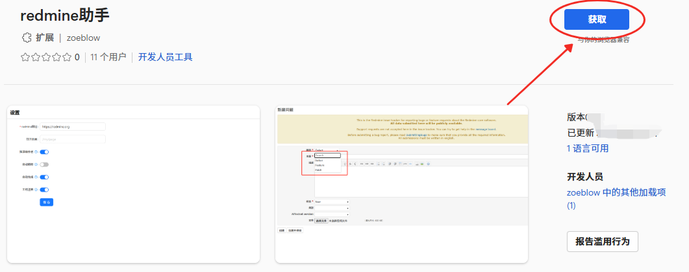
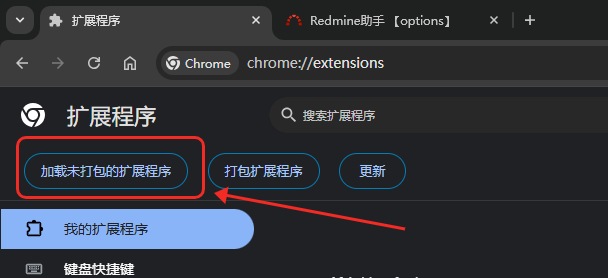
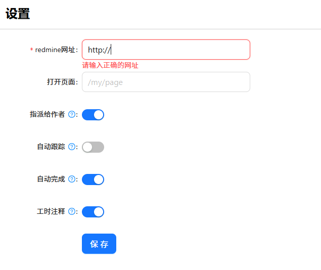

<!--
 * @Description:
 * @Author: zoeblow
 * @Email: zoeblow#gmail.com
 * @Date: 2025-03-20 17:03:41
 * @LastEditors: zoeblow
 * @LastEditTime: 2025-09-02 17:13:40
 * @FilePath: \redmine-helper\README.md
 * Copyright (c) 2025 by zoeblow , All Rights Reserved.
 *
-->

# redmine 助手

`redmine助手` 可以帮助您改善 `redmine` 的使用体验。比如将默认的下拉框改为可以搜索、设置完任务单状态后自动跟踪该任务、可以随时知道当前任务数量等等。

## 使用

- 🍄 访问 [Chrome 应用商店](https://chrome.google.com/webstore/) 在线安装-(没有注册账户，无法上传到应用商店，请手动下载安装)暂时无法提供安装

- 🐮 访问 [Edge 应用商店](https://microsoftedge.microsoft.com/addons/detail/fbiogedcikiecboialbmplkhpcdckcam) 在线安装 ⬇⬇⬇

- 🐼 下载 通过 Chrome 拓展程序管理器 [加载未打包的扩展程序](https://github.com/zoeblow/redmine-helper/releases) 手动安装 ⬇⬇⬇

🍼 首次使用需要在设置页面（右键图标点击选项）配置您的 redmine 网站地址。 ⬇⬇⬇

## 功能

- 🔍 下拉框改为可以搜索
- ✍ 设置完任务单状态后自动跟踪该任务

## 许可证

MIT
